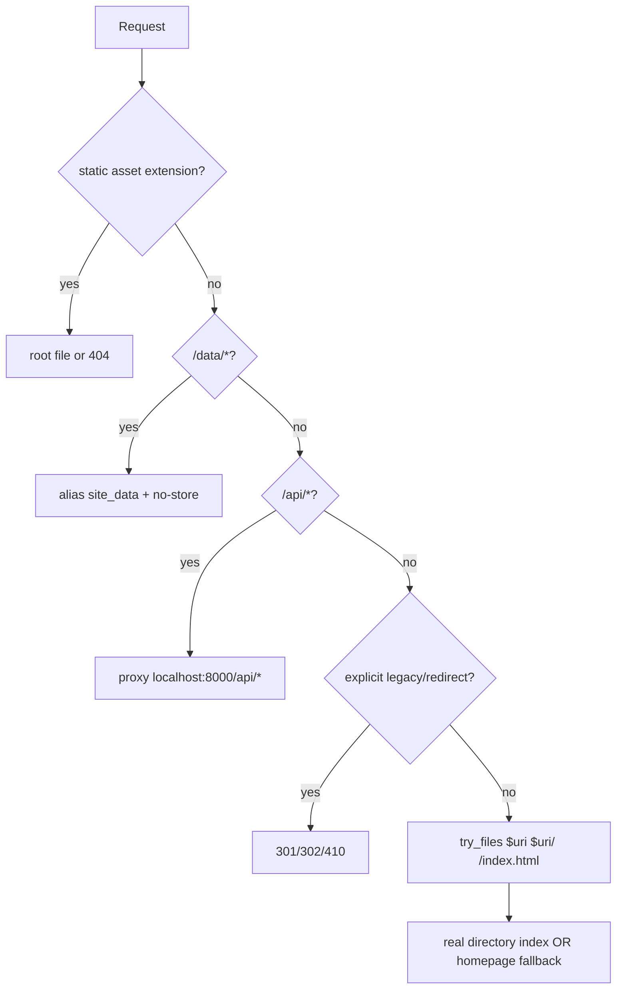

# Phase 1 Prod Audit - Route, Navigation, Doctrine

Date: 2026-05-04
Target: `oceansentinelle.fr`
Mode: read-only forensic audit

## 1. Architecture Map

### Effective Nginx Excerpt

Command:

```sh
sudo nginx -T 2>/dev/null | nl -ba | sed -n "228,316p"
```

Useful excerpt:

```text
228 server {
231     server_name oceansentinelle.fr www.oceansentinelle.fr;
232     return 301 https://$host$request_uri;
235 server {
238     server_name oceansentinelle.fr www.oceansentinelle.fr;
243     root /var/www/oceansentinelle;
251     location ~* \.(mp3|ogg|wav|m4a)$ { ... try_files $uri =404; }
258     location ~* \.(js|css|png|jpg|jpeg|gif|ico|svg|woff|woff2|ttf|eot)$ { ... try_files $uri =404; }
264     location = /dashboard { return 301 /dashboard/; }
268     location /data/ {
269         alias /opt/oceansentinel/current/site_data/;
270         add_header Cache-Control "no-store" always;
271         default_type application/json;
274     location = /api { return 301 /api/; }
278     location = /api/ { return 302 /dashboard/; }
282     location /api/ { proxy_pass http://localhost:8000/api/; }
300     location = /about { return 410; }
301     location = /about.html { return 410; }
304     location = /api.html { return 410; }
305     location = /data-status { return 410; }
306     location ^~ /data-status/ { return 410; }
308     location = /podcast { return 301 /podcast/; }
311     location / {
312         try_files $uri $uri/ /index.html;
313         add_header Cache-Control "no-cache, no-store, must-revalidate";
```

Resolution order:

```text
HTTP -> HTTPS 301
static extensions -> root file, else 404
/data/* -> alias /opt/oceansentinel/current/site_data/*, no-store
/api -> /api/ -> /dashboard/
/api/* -> proxy http://localhost:8000/api/*
selected legacy routes -> 410
/podcast -> /podcast/
everything else -> $uri, $uri/, then /index.html
```

### Route To File

Command:

```sh
for u in / /transparence/ /simulations/ /dashboard/ /dashboard/simulations/ \
  /dashboard/simulations/library/ /dashboard/transparence/osint/ \
  /dashboard/transparence/infrastructure/ /podcast/ /projet/; do
  ...
done
```

| URL | File served now | Resolution |
| --- | --- | --- |
| `/` | `/var/www/oceansentinelle/index.html` | direct root index |
| `/transparence/` | `/var/www/oceansentinelle/transparence/index.html` | directory index |
| `/simulations/` | `/var/www/oceansentinelle/simulations/index.html` | directory index |
| `/dashboard/` | `/var/www/oceansentinelle/dashboard/index.html` | directory index |
| `/dashboard/simulations/` | `/var/www/oceansentinelle/dashboard/simulations/index.html` | directory index |
| `/dashboard/simulations/library/` | `/var/www/oceansentinelle/dashboard/simulations/library/index.html` | directory index |
| `/dashboard/transparence/osint/` | `/var/www/oceansentinelle/dashboard/transparence/osint/index.html` | directory index |
| `/dashboard/transparence/infrastructure/` | `/var/www/oceansentinelle/dashboard/transparence/infrastructure/index.html` | directory index |
| `/podcast/` | `/var/www/oceansentinelle/podcast/index.html` | directory index |
| `/projet/` | `/var/www/oceansentinelle/projet/index.html` | directory index |
| `/no-such-route` | `/var/www/oceansentinelle/index.html` | fallback ghost route |

Diagram:



### Data/API Safeguards

```text
/data/BARAG_PROXY.public_status.json -> HTTP/2 200, content-type application/json, cache-control no-store
/api/ -> HTTP/2 302, location /dashboard/
/api/health -> HTTP/2 405 from proxied service for HEAD
```

## 2. Ghost Routes

Header proof:

```text
/                 HTTP/2 200  content-length: 13991  etag: "69f7d340-36a7"
/no-such-route    HTTP/2 200  content-length: 13991  etag: "69f7d340-36a7"
```

Hash proof:

```text
/                                          2ae1a9815b953ec651f8d924c60a597bc3c4375145496c45da7046dddd22f9e6
/no-such-route                             2ae1a9815b953ec651f8d924c60a597bc3c4375145496c45da7046dddd22f9e6
/transparence/                             8dcd6026b56bd846edad1eb246c4c5e60db14a1274a7bb4405dbdbc4005d1459
/simulations/                              708c5108bad0aff92d79cd950b5019ab2d69fdba53cbf2ff6ee532860e5a4d62
/dashboard/simulations/                    bf92164b32047673ba1eab3415006e0699a3eedfcef3768e9fed146cefe47c50
```

Confirmed ghost route: `/no-such-route` returns homepage as `200`.
`/transparence/` and `/simulations/` are not ghost routes now; they are real marketing route files.

## 3. Navigation Report

All current canonical HTML files load `os_nav_v2.css` and `os_nav_v2.js`, and include
`<div id="os-topnav"></div>`.

| File | os_nav_v2 CSS/JS | `#os-topnav` | inline `<nav>` | Classification |
| --- | --- | ---: | ---: | --- |
| `/index.html` | yes | 1 | 1 | double source, client-hidden legacy |
| `/dashboard/index.html` | yes | 1 | 1 | double source, client-hidden legacy |
| `/dashboard/simulations/index.html` | yes | 1 | 0 | os_nav only |
| `/dashboard/simulations/library/index.html` | yes | 1 | 1 | double source, client-hidden legacy |
| `/dashboard/transparence/infrastructure/index.html` | yes | 1 | 1 | double source, client-hidden legacy |
| `/dashboard/transparence/osint/index.html` | yes | 1 | 1 | double source, client-hidden legacy |
| `/podcast/index.html` | yes | 1 | 0 | os_nav only |
| `/projet/index.html` | yes | 1 | 0 | os_nav only |
| `/simulations/index.html` | yes | 1 | 0 | os_nav only |
| `/transparence/index.html` | yes | 1 | 0 | os_nav only |

Cause:

```text
os_nav_v2.js injects a <nav> into #os-topnav, then scans nav/header candidates and adds
.os-legacy-nav to likely old navs. This reduces visible double navs but leaves two nav systems
in the HTML and depends on client-side masking.
```

Current `os_nav_v2` tab order:

```text
Accueil
Dashboard
Simulations IA
OSINT v1.2
Bibliothèque
Infrastructure Overview
Le Projet
Podcast
```

Required order for remediation:

```text
Accueil
Dashboard
Simulations IA
Bibliothèque
OSINT v1.2
Infrastructure Overview
Le Projet
Podcast
```

## 4. `/dashboard/simulations/` Page Diagnostic

File proof:

```text
-rw-r--r-- 1 root root 905 May 3 22:59 /var/www/oceansentinelle/dashboard/simulations/index.html
```

The page is a real file, but it is a minimal placeholder. It loads only `os_nav_v2.css/js` and uses
inline `main` styling:

```html
<body>
  <div id="os-topnav"></div>
  <main style="max-width:980px;margin:0 auto;padding:24px;...;color:#eaf4ff">
```

Cause of the reported blank/fragile rendering:

```text
No page-level background or shared layout CSS is loaded. Text is light (#eaf4ff), but if the browser
or any global reset leaves the body background white, the page reads as low contrast or "blank".
```

Corrective direction:

```text
Load one shared public stylesheet or add a minimal body/background rule for this page; keep os_nav_v2
as the only nav source; preserve shadow_mode=true, alert_allowed=false, decision_ready=false.
```

## 5. Doctrine / Forbidden Terms

Targeted grep on served webroot found these actively concerning paths:

```text
/var/www/oceansentinelle/podcast/index.html
/var/www/oceansentinelle/assets/API-DI_F4z2V.js
/var/www/oceansentinelle/assets/About-DsVNpEbH.js
/var/www/oceansentinelle/assets/Dashboard-9M3DEVC5.js
/var/www/oceansentinelle/assets/Home-BMcYc-eu.js
/var/www/oceansentinelle/assets/Legal-CjFNsjmk.js
/var/www/oceansentinelle/assets/index-CW28djC1.js
/var/www/oceansentinelle/assets/index-CW28djC1.patch-20260502T210550Z.js
/var/www/oceansentinelle/assets/index-CW28djC1.patch-20260502T210550Z.patch-20260502T212458Z.js
/var/www/oceansentinelle/assets/semantic-truth-overlay.js
```

Short context from canonical HTML:

```text
/var/www/oceansentinelle/podcast/index.html:31:
  Aucun contenu de cette page ne constitue une mesure en temps réel ni une alerte opérationnelle.
```

Short context from a served legacy asset:

```text
/var/www/oceansentinelle/assets/API-DI_F4z2V.js:
  API REST
  TimescaleDB
  MCP
  Données temps réel (rafraîchissement 5 min)
```

## 6. Usage Evidence

Last 5000 access log lines:

```text
Top 404:
61 /api/v1/stations

Top URLs:
189 /
61 /api/v1/stations
60 /api/health
22 /favicon.ico
18 /assets/os_nav_v2.js
18 /assets/os_nav_v2.css
10 /robots.txt
10 /dashboard/transparence/infrastructure/
9 /projet/
9 /dashboard/transparence/osint/

Top referers:
149 "https://oceansentinelle.fr"
67 "-"
61 "https://oceansentinelle.fr/api/v1/stations"
60 "https://oceansentinelle.fr/api/health"
47 "https://oceansentinelle.fr/"
8 "https://oceansentinelle.fr/dashboard/simulations/library/"
```

Asset usage:

```text
18 /assets/os_nav_v2.js
18 /assets/os_nav_v2.css
3  /assets/$%7Bt.href%7D
```

HTML references include current `os_nav_v2` on canonical pages. Old `os_nav.css/js` references were
found in `.bak.autopatch` backup files, not current canonical HTML.

## Phase 2 Remediation Plan

Branch: `fix/nav-routing-unification`

### PR1: unified navigation

Commit proposal:

```text
fix(web): remove inline nav from canonical pages
fix(web): align os_nav_v2 tab order and active state
```

Scope:

```text
Remove inline <nav> blocks from index, dashboard, library, osint, infrastructure.
Keep exactly one #os-topnav mount per canonical page.
Set os_nav_v2 order to Accueil, Dashboard, Simulations IA, Bibliothèque, OSINT v1.2,
Infrastructure Overview, Le Projet, Podcast.
Keep horizontal scroll for overflow.
```

Rollback:

```text
Restore the pre-PR HTML files from deployment backup or git revert the PR commit.
```

### PR2: route hardening and controlled 404

Commit proposal:

```text
fix(nginx): replace homepage fallback with controlled 404
```

Patch direction:

```nginx
error_page 404 /404.html;

location = /404.html {
    internal;
}

location = /dashboard { return 301 /dashboard/; }
location = /projet { return 301 /projet/; }
location = /podcast { return 301 /podcast/; }
location = /simulations { return 301 /simulations/; }
location = /transparence { return 301 /transparence/; }

location / {
    try_files $uri $uri/ /404.html =404;
    add_header Cache-Control "no-cache, no-store, must-revalidate";
}
```

Preserve:

```text
/data/ alias with no-store
/api and /api/ behavior
/api/* proxy
static asset try_files $uri =404
legacy 410 routes
```

Rollout:

```sh
sudo cp /etc/nginx/sites-available/oceansentinelle /etc/nginx/sites-available/oceansentinelle.bak-20260504
sudo nginx -t
sudo systemctl reload nginx
```

Rollback:

```sh
sudo cp /etc/nginx/sites-available/oceansentinelle.bak-20260504 /etc/nginx/sites-available/oceansentinelle
sudo nginx -t
sudo systemctl reload nginx
```

### PR3: legacy cleanup

Commit proposal:

```text
chore(web): quarantine unreferenced legacy assets
fix(web): remove forbidden claims from served assets
```

Approach:

```text
Build manifest from canonical HTML + recent access logs.
Keep os_nav_v2.css/js.
Quarantine proof-only orphan assets into assets/_quarantine/2026-05-04.tar.gz.
Do not delete until 48h access log confirms no requests.
Patch still-served assets or rebuild app bundle so forbidden terms disappear from served files.
```

### PR4: automated audit scripts

Commit proposal:

```text
test(web): add route nav doctrine audit scripts
```

Checks:

```text
curl -I canonical routes -> 200/301 expected
curl -I random missing route -> 404 expected
grep forbidden terms on canonical HTML and served assets
verify one #os-topnav mount and zero inline <nav> in canonical HTML
verify /data/*.json remains 200 + no-store
verify /api/ still redirects to /dashboard/
```

